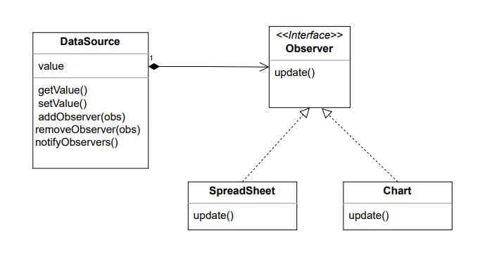

# The Observer pattern 

We use this pattern in a situation where the state of an object changes and we need to notify other 
objects about thoses changes.

It's also know as a Publish/Subscriber patter

## Communication style
### Push style

The ConcreteObsever is not dependant on he ConcreteSubject because he receive all the data he needs 
from the update method. 
However there is problem with this approch: If we introduce different type of obsever which needs differents types of value, 
the approch will not be flexible. 

We need a Pull style communication. 
### Pull style

Instead of the subject pushing the changes to the observers, they can pull the data they need when changes occur.

In this example we are coupling our ConcreteObserver to our ConcreteSubject, this is not a bad coupling.
The opposite would be a bad coupling because in our example we do not want our DataSource be dependant on Spreasheet or charts because they can change in the future; also you may introduce 
new type of obsever in the future and you don't want to change your data source every you introduce a new observer. In reality their is no zero coupling in software, what matter is the direction of the coupling. 

